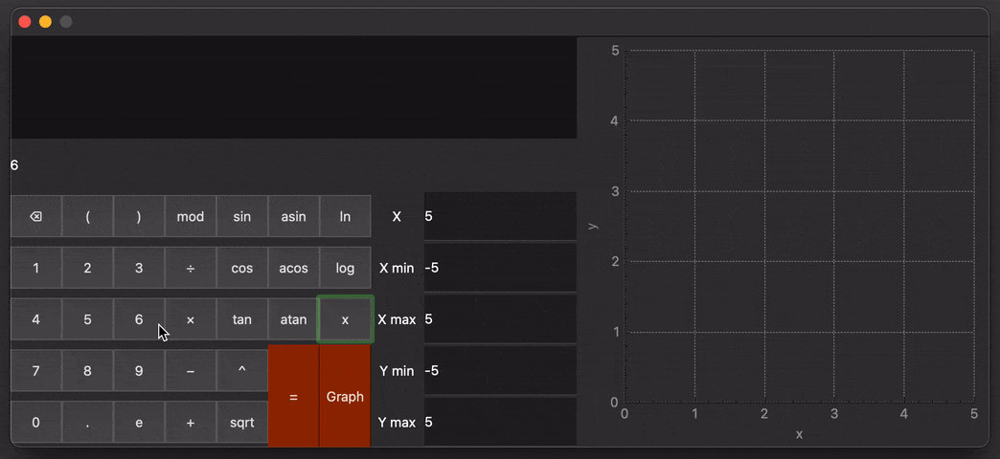
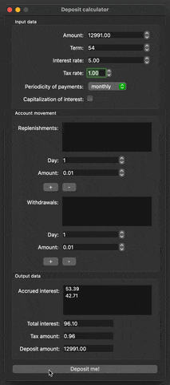

# QT-Projects

## Данный репозиторий содержит два десктопных приложения:

1. [Calculator](#calculator)
2. [3D Viewer v1](#3d-viewer-v1)

## Calculator

### Описание проекта
Приложение, содержащее в себе функционал [математического калькулятора](#математический-калькулятор) с построением графиков функции, [кредитный калькулятор](#кредитный-калькулятор) и [депозитный калькулятор](#депозитный-калькулятор).

#### Математический калькулятор




- Вычисление математических выражений;
- Тригонометрические функции, корень и логарифм;
- Подстановка значения в переменную Х;
- Отрисовка графика функции;
- Ограничение области определения и области значений графика.

#### Кредитный калькулятор


- Ввод данных условий кредита: сумма, срок и процентная ставка;
- Выбор типа платежа по кредиту - дифференцированный или аннуитетный;
- Вывод данных по заданным условиям кредита: ежемесячные платежи, переплата и общий платеж по кредиту.

#### Депозитный калькулятор



- Ввод данных условий депозита: сумма, срок депозитного договора, процентная ставка и налоговая ставка на прибыль;
- Выбор периодичности платежа по депозиту: ежемесячный, квартальный или ежегодный;
- Возможность расчета депозита с капитализацией;
- Список пополнений и снятий депозита в течение срока действия депозитного договора;
- Вывод данных по заданным условиям депозита: выплаты в соответствии с выбранным типом платежа, общая сумма прибыли, сумма удерживаемого налога, сумма на счету к концу срока действия депозитного договора.

### Особенности

- Использование C++: приложение написано на языке C++ с использованием стандарта C++17 и отформатирован в соответствии с C++ Google Style;
- Расчеты математического выражения производятся при помощи **алгоритма обратной польской нотации**;
- Парсер выражения преобразовывает строку в очередь (std::deque) из специальной структуры данных, представленной вложенным классом Element;
- Приложение построено с использвонием архитектурного паттерна MVC;
- Графический интерфейс реализован при помощи фреймворка QT6 с использованием стандарта C++17;
- Задокументированный код с использованием разметки doxygen.

### Сборка

Для сборки используется Makefile, включены стандартные GNU цели сборки: **all, install, uninstall, clean, dvi, dist, test, gcov**. 
- Тестирование проекта: ```make test```
- Установка приложения: ```make install```
- Создание архива приложения: ```make dist```
- Отчёт о покрытии кода тестами: ```make gcov_report```
- Документация кода: ```make dvi```

### Docker

Сборка в контейнере Ubuntu с помощью скрипта ```run.sh```, который собирает образ, запускает контейнер и тесты библиотеки в нём через динамический анализатор кода Valgrind.


## 3D Viewer v1

### Описание проекта
Приложение, с помощью которого можно открывать и просматривать трехмерные модели формата obj.

 В функционале имеются следующие возможности:
- Вращение модели по осям X, Y, Z с возможностью выбора шага изменений;
- Перемещение модели по осям X, Y, Z с возможностью выбора шага изменений;
- Масштабирование модели с возможностью выбора шага изменений;
- Выбор типа проекции - центральная или параллельная;
- Настройка вида граней модели - целые или пунктирные линии;
- Настройка толщины и цвета граней модели;
- Настройка вида отображения вершин модели - круглые, квадратные, отсутствие;
- Настройка размера и цвета вершин модели;
- Выбор цвета фона;
- Отображение имени файла, количества вершин и граней модели в строке состояния;
- Запись скриншота модели в формате png или jpg;
- Запись 5-секундного скринкаста движения модели в формате gif с частотой 10 fps и разрешением 640х480;


### Особенности

- Использование C11: основной механизм приложения написан на языке C с использованием стандарта C11;
- Парсер obj файла, принимающий параметры координат вершин фигуры и индексы вершин, соединяющихся в полигоны;
- Афинные преобразования при помощи матриц трансформации, перемещения и масштабирования;
- Матрицы реализованы на основе двумерных массивов;
- Графический интерфейс реализован при помощи фреймворка QT6 с использованием стандарта C++17;
- Задокументированный код с использованием разметки doxygen.

### Сборка

Для сборки используется Makefile, включены стандартные GNU цели сборки: **all, install, uninstall, clean, dvi, dist, test, gcov**. 
- Тестирование проекта: ```make test```
- Установка приложения: ```make install```
- Создание архива приложения: ```make dist```
- Отчёт о покрытии кода тестами: ```make gcov_report```
- Документация кода: ```make dvi```

