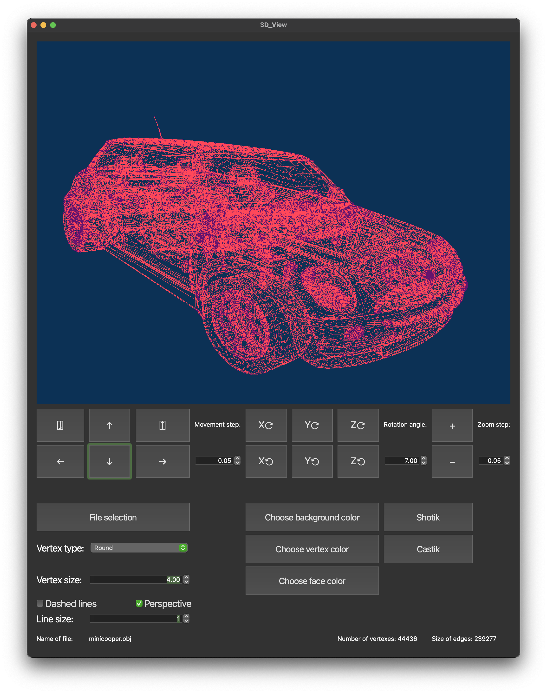
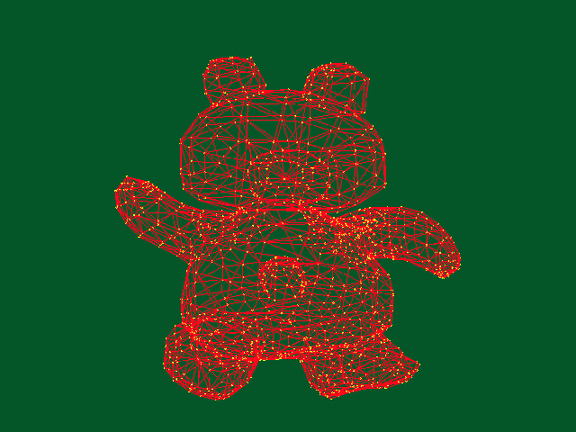

# QT-Projects

## Данный репозиторий содержит два десктопных приложения:
1. [3D Viewer v1](#3d-viewer-v1)
2. [Calculator](#calculator)


## 3D Viewer v1

### Описание проекта
Программа, с помощью которой можно открывать и просматривать трехмерные модели формата obj.

 В функционале имеются следующие возможности:
- Вращение модели по осям X, Y, Z с возможностью выбора шага изменений;
- Перемещение модели по осям X, Y, Z с возможностью выбора шага изменений;
- Масштабирование модели с возможностью выбора шага изменений;
- Выбор типа проекции - центральная или параллельная;
- Настройка вида граней модели - целые или пунктирные линии;
- Настройка толщины и цвета граней модели;
- Настройка вида отображения вершин модели - круглые, квадратные, отсутствие;
- Настройка размера и цвета вершин модели;
- Выбор цвета фона;
- Отображение имени файла, количества вершин и граней модели в строке состояния;
- Запись скриншота модели в формате png или jpg;
- Запись 5-секундного скринкаста движения модели в формате gif с частотой 10 fps и разрешением 640х480;




### Особенности

- Использование C11: основной механизм приложения написан на языке C с использованием стандарта C11;
- Парсер obj файла, принимающий параметры координат вершин фигуры и индексы вершин, соединяющихся в полигоны;
- Афинные преобразования при помощи матриц трансформации, перемещения и масштабирования;
- Матрицы реализованы на основе двумерных массивов;
- Графический интерфейс реализован при помощи фреймворка QT6 с использованием стандарта C++17.

### Сборка
Для сборки используется Makefile, включены стандартные GNU цели сборки: **all, install, uninstall, clean, dvi, dist, test, gcov**. 
- Тестирование проекта: ```make test```
- Установка приложения: ```make install```
- Создание архива приложения: ```make dist```
- Отчёт о покрытии кода тестами: ```make gcov_report```


## Calculator

### Описание проекта

### Особенности

### Сборка

### Docker

Сборка в контейнере Ubuntu с помощью скрипта ```run.sh```, который собирает образ, запускает контейнер и запускает тесты библиотеки через динамический анализатор кода Valgrind.

